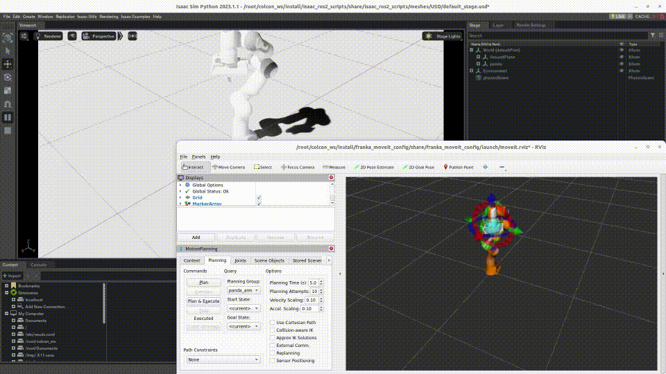

# Demo For Arm Robot



1. Install Docker and pull [Isaac Sim Docker Image](https://docs.omniverse.nvidia.com/app_isaacsim/app_isaacsim/install_container.html).

2. Clone the repo to your ros2 workspace<br/>
   ```bash
   git clone https://github.com/hijimasa/isaac-ros2-control-sample.git
   ```

3. Get git submodules<br/>
   ```bash
   cd isaac-ros2-control-sample
   git submodule update --init --recursive
   ```

4. Build a docker image with shell script.<br/>
   ```bash
   cd docker
   ./build_docker_image.sh
   ```

5. Launch a docker container<br/>
   ```bash
   ./launch_docker.sh
   ```

6. Build ros2 source codes<br/>
   ```bash
   colcon build && source install/setup.bash
   ```

7. Launch simulator<br/>
   ```bash
   ros2 run isaac_ros2_scripts launcher
   ```

8. To spawn robot (another terminal)<br/>
   ```bash
   docker exec -it isaac-sim /bin/bash
   ros2 launch franka_moveit_config demo.launch.py 
   ```
   <br/>You can control the robot from RViz.
   
> [!NOTE]
> For the first time, launching Isaac Sim takes a very long time.
> Isaac Sim must be fully launched to spawn the robot.
