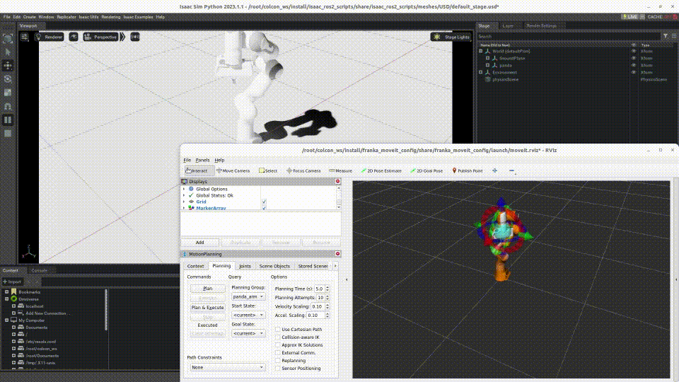

# アームロボット向けデモ



このデモには、ドライバー575以降のNVIDIA GPUが必要です。

1. Dockerをインストールし、[Isaac SimのDockerイメージ](https://docs.isaacsim.omniverse.nvidia.com/latest/installation/install_container.html)（`nvcr.io/nvidia/isaac-sim:6.0.1`）を取得します。

2. リポジトリをクローンします<br/>
   ```bash
   git clone https://github.com/hijimasa/isaac-ros2-control-sample.git
   ```

3. サブモジュールを取得します<br/>
   ```bash
   cd isaac-ros2-control-sample
   git submodule update --init --recursive
   ```

4. シェルスクリプトでDockerイメージをビルドします<br/>
   ```bash
   cd docker
   ./build_docker_image.sh
   ```

5. Dockerコンテナを起動します<br/>
   ```bash
   ./launch_docker.sh
   ```

6. ROS 2のソースコードをビルドします<br/>
   ```bash
   colcon build && source install/setup.bash
   ```

7. シミュレーターを起動します<br/>
   ```bash
   ros2 run isaac_ros2_scripts launcher
   ```

8. ロボットをスポーンします（別のターミナルで）<br/>
   ```bash
   docker exec -it isaac-sim /bin/bash
   ros2 launch franka_moveit_config demo.launch.py 
   ```

9. Isaac Simウィンドウの**Play**ボタン（▶）を押してシミュレーションを
   開始します。
   <br/>RVizからロボットを操作できます。

> **補足:** 初回のIsaac Simの起動には非常に時間がかかります。
> ロボットをスポーンするには、Isaac Simが完全に起動している必要があります。
